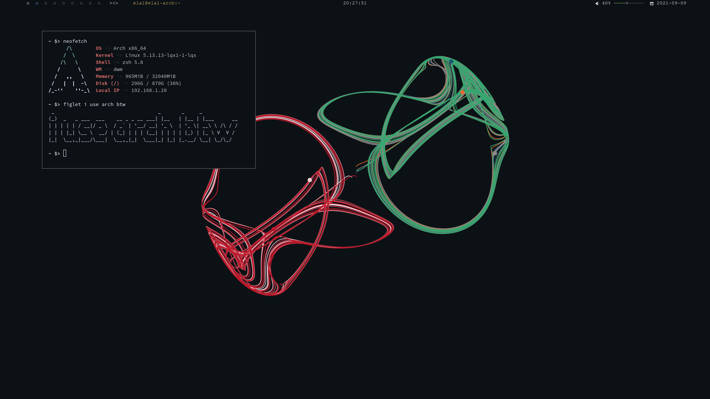

## Installing dotfiles
`$ ./stow.sh (stow option)`
	-S, --stow 	: Install
	-D, --delete	: Uninstall
**i.e.** `$ ./stow.sh -S`

## Specs
 - **OS**: Arch Linux
 - **WM**: [dwm](http://github.com/E-Almqvist/dwm) 
 - **Terminal**: Alacritty 
 - **Editor**: nvim
 - **Compositor**: picom 
 - **Bar**: polybar
 - **Launcher**: dmenu
