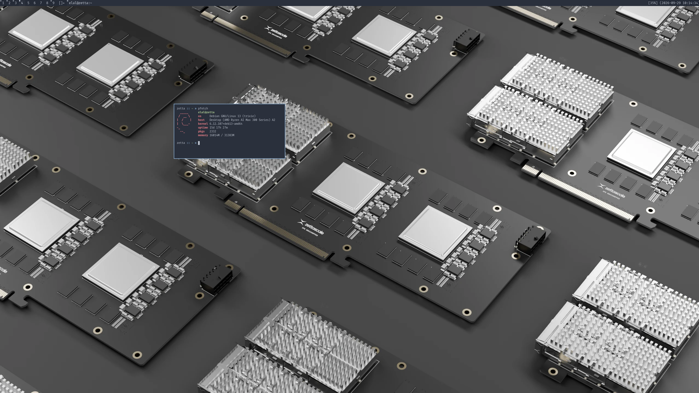

## Stuff I use
 - **WM**: [ewm](https://github.com/almqv/ewm)
 - **Bar**: ewm's built-in bar ([status.lua](ewm/.config/ewm/plugins/status.lua))
 - **Terminal**: [Alacritty](https://github.com/alacritty/alacritty)
 - **Editor**: [nvim](https://github.com/neovim/neovim) or [Emacs](https://github.com/emacs-mirror/emacs)
 - **Launcher**: [dmenu](https://git.suckless.org/dmenu/)
 - **Locker**: [slock](https://git.suckless.org/slock/)

## Installing dotfiles
`git clone https://github.com/almqv/dotfiles.git && cd dotfiles`

Then use [stow](https://www.gnu.org/software/stow/) to create symlinks for each *dotfile*: `$ stow (stow options) (package)`
	
	-S, --stow 	: Install
	-D, --delete	: Uninstall
	Read more in the manual page for stow.
	$ man stow

**i.e.** `$ stow -S vim`

------------

## Darwin Configuration (nix-darwin + home-manager)
I use [nix-darwin](https://github.com/LnL7/nix-darwin) and [home-manager](https://github.com/nix-community/home-manager). I suggest you do too. `stow` is fine until it isn't. 

If you want to try out my nix config, then you can do this:
```sh
darwin-rebuild switch --flake ~/.dotfiles/nix-darwin#exa
```
or 
```sh
darwin-rebuild switch --flake github:almqv/dotfiles/nix-darwin#exa
```

Be sure that your hostname is `exa` and your username is `elal`.

I suggest you change the above to **your** hostname and **your** username.
