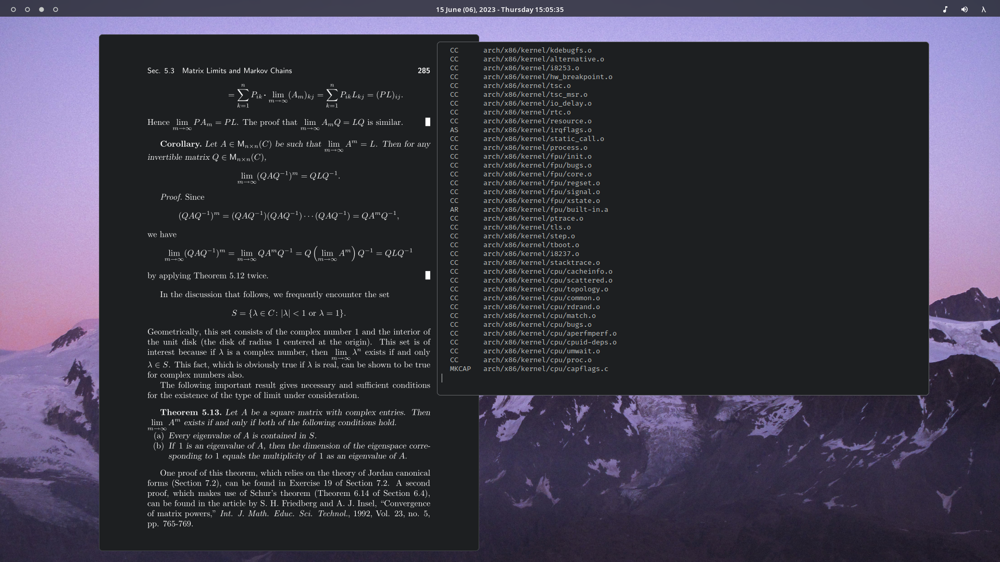

## Installing dotfiles
`$ stow (stow options) (package)`
	
	-S, --stow 	: Install
	-D, --delete	: Uninstall
	Read more in the manual page for stow.
	$ man stow

**i.e.** `$ stow -S vim`

## Specs
 - **OS**: (Arch Linux)[https://archlinux.org/]
 - **Kernel**: [lqx](https://liquorix.net/) *(standard linux as fallback)*
 - **WM**: [ewm](http://github.com/E-Almqvist/ewm) or [XMonad](https://xmonad.org/)
 - **Terminal**: [Alacritty](https://github.com/alacritty/alacritty)
 - **Editor**: [nvim](https://neovim.io/)
 - **Compositor**: [picom](https://github.com/yshui/picom)
 - **Bar**: [polybar](https://polybar.github.io/)
 - **Launcher**: [rofi](https://github.com/davatorium/rofi)
